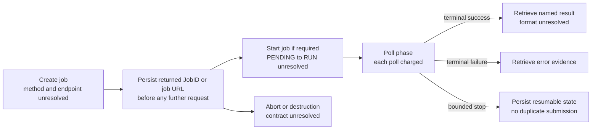

# OC3 NOIRLab Data Lab TAP/UWS Async Documentary Investigation 001

Status: **OFFLINE DOCUMENTARY REVIEW COMPLETE**.

## Scope and evidence boundary

This review used only official NOIRLab artifacts already preserved locally. It made zero network requests, submitted no job, read no source rows and did not alter the frozen ADQL. Run-004 and Manual Acquisition Attempt 001 remain historical. Run-005 remains `NOT_STARTED / WAITING_FOR_POST_TIMEOUT_ACQUISITION_DECISION`.

The available corpus contains an official Data Lab manual index and an official TAP capabilities response. The index exposes links to TAP/SCS, Query Manager and Job Manager child pages, but their contents were not acquired. The capabilities response advertises a standard TAP root at `http://datalab.noirlab.edu/ivoa-dal/tap/`; it does not list a literal async endpoint, an HTTPS canonical endpoint, UWS operations or authentication behavior. Previous project evidence observed `https://datalab.noirlab.edu/tap/sync`, but that is operational sync evidence and cannot resolve the advertised-root discrepancy or define async behavior.

## Documentary findings

| Question | Classification | Finding |
|---|---|---|
| Canonical TAP endpoint | OFFICIAL DOCUMENTED BEHAVIOR, LIMITED | The captured capabilities body advertises `http://datalab.noirlab.edu/ivoa-dal/tap/`. Currency, HTTPS canonicalization and relation to the observed `/tap/sync` route are unresolved. |
| Exact async endpoint | CURRENTLY UNRESOLVED | No literal `/async` access URL is present in the preserved sources. Appending `/async` would be an unverified inference. |
| Creation method and parameters | CURRENTLY UNRESOLVED | POST/GET, `REQUEST=doQuery`, `LANG=ADQL`, `QUERY`, `FORMAT` and `PHASE=RUN` are not specified in the local NOIRLab corpus. |
| PENDING-to-RUN transition | CURRENTLY UNRESOLVED | No provider-specific rule is available. |
| Durable JobID return | CURRENTLY UNRESOLVED | Header, redirect, body and identifier syntax are undocumented locally. |
| Phase/status URL and phase vocabulary | CURRENTLY UNRESOLVED | No provider-specific UWS phase contract is available. |
| Result and error retrieval | CURRENTLY UNRESOLVED | Result identifiers, formats and error paths are undocumented locally. |
| Abort/cancel | CURRENTLY UNRESOLVED | No provider-specific operation is available. |
| Retention/destruction | CURRENTLY UNRESOLVED | No retention duration or destruction contract is available. |
| Execution/time limits | CURRENTLY UNRESOLVED | No async execution limit is documented in the local corpus. |
| Authentication and anonymous jobs | CURRENTLY UNRESOLVED | The capabilities body contains no usable declaration; Query Manager synchronous anonymity cannot be transferred to direct TAP async. |
| CSV output | CURRENTLY UNRESOLVED | The provider-specific async `FORMAT` vocabulary and result representation are unavailable. |
| Redirect behavior | CURRENTLY UNRESOLVED | No job-creation redirect contract is available. |
| Poll accounting | PROJECT ACCOUNTING REQUIREMENT | Every future HTTP creation, phase, result, error, abort or destruction operation must count as a provider request. This is a project rule, not claimed NOIRLab documentation. |
| Queued jobs, gateway errors, large Legacy Survey tables | CURRENTLY UNRESOLVED | No exact official Help Desk report or snapshot exists in the offline corpus. The prompt identifies topics, not evidence content. |

## Interface separation

The official index navigation names Catalog Data Access (TAP/SCS), Query Manager and Job Manager separately. This establishes that distinct documentation surfaces exist. It does not establish that Query Manager async and TAP/UWS async share endpoints, authentication, job identifiers or lifecycle behavior.

## Prospective lifecycle required before any probe

This is a required project sequence, not a claim that NOIRLab currently implements each edge as drawn. A future probe must freeze the provider-specific realization only after documentary acquisition resolves every required edge.

## Probe decision

No minimal anonymous probe specification is created. The prerequisite—documentary support for a plausible anonymous direct-TAP async path—is not met. Freezing an endpoint, POST body, phase transition, polling path or result URL now would invent provider semantics.

Decision: `TAP_ASYNC_CURRENTLY_INSUFFICIENTLY_DOCUMENTED`.

## Next human decision

Authorize, if desired, a separate bounded public-document acquisition containing only the three exact official child pages discovered in the preserved index plus a current capabilities refresh: at most four requests, four MiB total, concurrency one, retries zero, redirects zero and credentials zero. Help Desk observations must remain unresolved unless literal official URLs are supplied or separately discovered under a bounded rule. That acquisition would decide documentation sufficiency only; it would not submit a TAP job or authorize Run-005.
